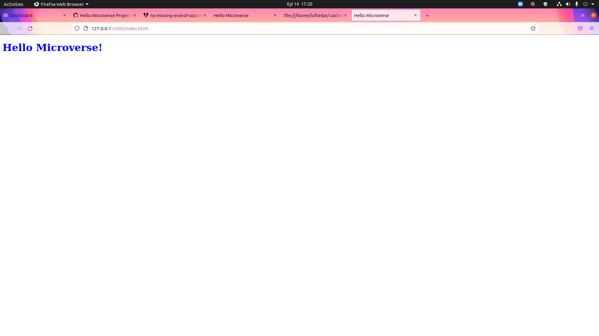

# HelloMicroverse

> Hello Microverse is the project that made for the first code review of the program. 

Additional description about the project and its features.

## Built With

- HTML & CSS
- GitHub Workflows

## Getting Started

To get a local copy up and running follow these simple example steps.

git clone https://github.com/luftedar/HelloMicroverse.git

Change into the working directory.

cd HelloMicroverse

Now, You are ready to use.

## Prerequisites

- Code Editor

## Authors

👤 **Author1**

- GitHub: [@githubhandle](https://github.com/luftedar)
- Twitter: [@twitterhandle](https://twitter.com/OrcunUgur2)
- LinkedIn: [LinkedIn](https://linkedin.com/in/or%C3%A7un-u%C4%9Fur-089148181/)

## 🤝 Contributing

Contributions, issues, and feature requests are welcome!

Feel free to check the [issues page](../../issues/).

## Show your support

Give a ⭐️ if you like this project!

## Acknowledgments

- Hat tip to anyone whose code was used
- Inspiration
- etc

## 📝 License

This project is [MIT](./MIT.md) licensed.
